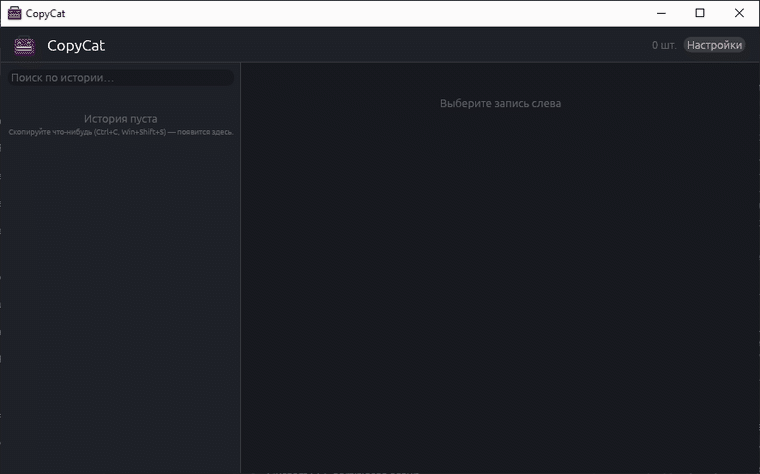

<div align="center">


# CopyCat

**Менеджер истории буфера обмена для Windows.**
Живёт в трее, ловит всё, что вы копируете, и по `Ctrl+Shift+V` возвращает это обратно.

[](https://github.com/SchrodingerBox-Softworks/copy-cat/actions/workflows/rust.yml)
[](https://github.com/SchrodingerBox-Softworks/copy-cat/actions/workflows/release.yml)
[](https://github.com/SchrodingerBox-Softworks/copy-cat/releases/latest)
[](LICENSE)




</div>

[](https://www.rust-lang.org)

---

## Что это

Windows умеет хранить историю буфера обмена (`Win+V`), но только текст, без поиска,
без закрепления и с записью в облако. CopyCat делает то же самое локально: всё лежит
в обычных файлах рядом с `.exe`.

- **Текст и картинки.** Скриншот из `Win+Shift+S` попадает в историю так же, как строка из `Ctrl+C`.
- **Глобальный хоткей.** `Ctrl+Shift+V` (настраивается) открывает окно прямо у курсора.
- **Автовставка.** Выбрали запись — CopyCat прячется, возвращает фокус прошлому окну и жмёт `Ctrl+V` за вас.
- **Поиск** по всей истории и **закрепление** (`PIN`) записей, которые не должны вытесняться лимитом.
- **Массовое удаление** по чекбоксам, `Delete` — по выбранной записи.
- **Тёмная тема** по умолчанию, переключается на светлую или системную в настройках.
- **Автозапуск** с Windows одной галочкой.
- **Portable.** Настройки и история — рядом с `.exe`, ничего не пишется в `%AppData%` и в реестр (кроме ключа автозапуска, если вы его включите).

## Установка

Скачайте `copy-cat-vX.Y.Z-x86_64-windows.zip` со страницы
[**Releases**](https://github.com/SchrodingerBox-Softworks/copy-cat/releases/latest)
и распакуйте — внутри готовая папка:

```
copy-cat-vX.Y.Z\
├─ copy-cat.exe
├─ README.txt        # краткая инструкция
└─ LICENSE.txt
```

Запустите `copy-cat.exe` — приложение свернётся в трей. Установка не нужна,
удаление — удалить папку.

> [!IMPORTANT]
> Кладите папку туда, где есть право на запись (например, `C:\Tools\CopyCat\`,
> а не `C:\Program Files\`) — рядом с `.exe` создаются `settings.json` и папка `clipboard/`.

Проверить загрузку:

```powershell
Get-FileHash .\copy-cat-vX.Y.Z-x86_64-windows.zip -Algorithm SHA256
```

Хэш опубликован в описании релиза.

## Как пользоваться

| Действие | Как |
| --- | --- |
| Открыть окно | `Ctrl+Shift+V` или двойной клик по иконке в трее |
| Спрятать окно | `Esc` или крестик (приложение остаётся в трее) |
| Вставить запись | Двойной клик по строке или кнопка **Вставить** |
| Выбрать для просмотра | Одиночный клик по строке |
| Найти | Поле **Поиск по истории…** над списком |
| Закрепить | Кнопка **Закрепить** в превью — запись получает метку `PIN` и не вытесняется лимитом |
| Удалить | `Delete`, или чекбоксы + **Удалить выбранные** |
| Выйти | Правый клик по иконке в трее → **Выход** |

## Настройки

Кнопка **Настройки** в правом верхнем углу. Всё сохраняется в `settings.json`
рядом с `.exe` сразу после изменения.

| Параметр | По умолчанию | Что делает |
| --- | --- | --- |
| `theme` | `dark` | Оформление: `dark`, `light` или `system` (следовать теме Windows). |
| `max_items` | `100` | Сколько записей хранить. Лишние старые удаляются с диска; закреплённые не считаются и не вытесняются. |
| `poll_interval_ms` | `600` | Как часто опрашивается системный буфер обмена. Меньше — отзывчивее, больше — экономнее. |
| `hotkey` | `Ctrl+Shift+V` | Комбинация показа окна: `Ctrl+Shift+V`, `Alt+C`, `Ctrl+Alt+Space`… Если комбинация занята другим приложением, в настройках появится красная строка с ошибкой. |
| `hotkey_enabled` | `true` | Выключает хоткей, не стирая саму комбинацию. |
| `show_at_cursor` | `true` | Показывать окно у курсора, а не там, где оно было. |
| `auto_paste` | `true` | После выбора записи вернуть фокус прошлому окну и нажать `Ctrl+V`. Выключите, если хотите просто копировать в буфер. |
| `hide_after_copy` | `true` | Прятать окно после копирования (когда автовставка выключена). |
| `capture_text` | `true` | Ловить текст. |
| `capture_images` | `true` | Ловить картинки. |

## Где лежат данные

```
CopyCat\
├─ copy-cat.exe
├─ settings.json          # настройки
└─ clipboard\
   ├─ index.json          # метаданные: id, тип, время, размер, хэш, pinned
   ├─ 0000000001.txt      # тела текстовых записей
   └─ 0000000002.png      # тела картинок
```

В памяти держится только `index.json`; сам текст или PNG читается с диска
только для выбранной записи. Дубликаты отсекаются по хэшу FNV-1a.

> [!WARNING]
> История хранится в открытом виде. Скопированный пароль ляжет обычным `.txt`
> в папку `clipboard\`. Для чувствительных данных снимите галочку **Ловить текст**
> или удалите запись после использования.

## Сборка из исходников

Нужен [Rust](https://rustup.rs/) (edition 2024, MSRV 1.85) и MSVC-toolchain.

```powershell
git clone https://github.com/SchrodingerBox-Softworks/copy-cat.git
cd copy-cat
cargo build --release
```

Готовый бинарь — `target\release\copy-cat.exe`.

Проверки, которые гоняет CI:

```powershell
cargo fmt --all -- --check; cargo clippy --all-targets -- -D warnings; cargo test
```

## Как устроено

| Файл | За что отвечает |
| --- | --- |
| [`src/main.rs`](src/main.rs) | Окно на `eframe`/`egui`, иконка в трее, настройки, вся отрисовка |
| [`src/buffer.rs`](src/buffer.rs) | Хранилище истории на диске и фоновой поток-наблюдатель за буфером |
| [`src/hotkey.rs`](src/hotkey.rs) | Регистрация глобального хоткея, разбор строки вида `Ctrl+Shift+V` |
| [`src/paste.rs`](src/paste.rs) | WinAPI: запомнить активное окно, вернуть ему фокус и отправить `Ctrl+V` |
| [`src/autostart.rs`](src/autostart.rs) | Автозапуск через `HKCU\...\CurrentVersion\Run` |
| [`build.rs`](build.rs) | Вшивает `assets/icon.ico` в ресурсы `.exe` |

Стек: [`eframe`/`egui`](https://github.com/emilk/egui) · [`tray-icon`](https://github.com/tauri-apps/tray-icon) ·
[`arboard`](https://github.com/1Password/arboard) · [`global-hotkey`](https://github.com/tauri-apps/global-hotkey) ·
[`windows-sys`](https://github.com/microsoft/windows-rs)

## Лицензия

[MIT](LICENSE)

## Автор


[**Schrodinger71**](https://github.com/Schrodinger71) — Discord: schrodinger

<br clear="left">
